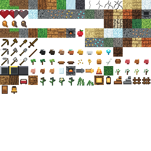

# Voxel Game

A desktop Java voxel survival game inspired by Minecraft-style exploration, crafting, and block building. The project focuses on a custom chunked world renderer, procedural terrain, survival systems, and expandable gameplay architecture.

This repository is intended to be easy to inspect from a CV or portfolio link: the source code is organized as a Gradle project, the texture atlas and documentation are included, and the build produces a runnable desktop JAR.

## Features

- Chunked voxel terrain with procedural biomes, caves/ores, water, lighting, and mesh generation.
- First-person movement, block targeting, mining, placement, and item drops.
- Inventory, hotbar, crafting, furnaces, tools, food, and survival vitals.
- Passive animals with scalable AI foundations, damage handling, drops, and persistence.
- Villages, villagers, schedules, professions, trade foundations, and village-oriented spawning for testing.
- Decorative/building blocks including plants, stairs, fences, gates, doors, beds, lamps, lanterns, and bells.
- Lightweight voxel-style rendering using LWJGL, OpenGL, a texture atlas, HUD/UI meshes, and world/entity renderers.
- Save/load support for player, chunks, entities, and gameplay state.

## Controls

| Action | Input |
| --- | --- |
| Move | `W` `A` `S` `D` |
| Look | Mouse |
| Jump / swim up | `Space` |
| Sprint | `Left Ctrl` / `Right Ctrl` |
| Sneak / descend in creative flight | `Left Shift` / `Right Shift` |
| Mine / attack | Left mouse |
| Place / interact / eat selected food | Right mouse |
| Hotbar selection | `1` through `9` |
| Inventory | `E` |
| Close menu / release cursor | `Esc` |
| Toggle debug UI | `F4` |
| Toggle game mode | `F9` |
| Quit | `F10` |

## Build

Requirements:

- JDK 21 or newer.
- Windows, Linux, or macOS desktop environment with OpenGL support.

Build the runnable JAR:

```powershell
powershell -ExecutionPolicy Bypass -File scripts\build.ps1
```

Or with Gradle directly:

```powershell
.\gradlew.bat clean build
```

The runnable fat JAR is generated at:

```text
build/libs/voxel-game.jar
```

## Run

```powershell
java --enable-native-access=ALL-UNNAMED -jar build\libs\voxel-game.jar
```

On supported desktop setups, double-clicking the JAR may also work. If the JVM blocks native access, use the command above.

Useful development launch option:

```powershell
java --enable-native-access=ALL-UNNAMED -jar build\libs\voxel-game.jar --spawn-near-village=true
```

## Screenshots And Visuals

The project uses a packed pixel-art texture atlas for terrain, items, UI, and decorative blocks.



Add gameplay screenshots or GIF captures to `docs/assets/` when preparing the final GitHub Pages portfolio page.

## Web Playability

The current game is a native desktop LWJGL/OpenGL application using GLFW windowing and platform-specific LWJGL native libraries. That architecture does not compile directly to a browser target through GitHub Pages.

A browser-playable version would require a separate rendering/input backend, such as a TeaVM-specific port or a custom WebGL frontend. For this release, GitHub Pages is used as an inspection and portfolio preview page, while playable builds are provided through the release JAR.

## Release Artifacts

The Gradle build creates:

- `build/libs/voxel-game.jar` - runnable desktop fat JAR.
- `build/distributions/voxel-game-1.0.0-source.zip` - source, assets, docs, and Gradle project files.

Suggested GitHub release tag:

```text
v1.0.0
```

## Repository Layout

```text
src/main/java/        Java source code
src/main/resources/   Runtime assets and texture atlas
scripts/              Build and asset helper scripts
docs/                 GitHub Pages inspection site
release-notes/        Release notes for GitHub releases
gradle/               Gradle wrapper files
```

## CV Link Format

After pushing to GitHub and enabling GitHub Pages from `/docs`:

- Playable build: `https://github.com/USERNAME/REPO/releases`
- Source code: `https://github.com/USERNAME/REPO`
- Live preview: `https://USERNAME.github.io/REPO/`
